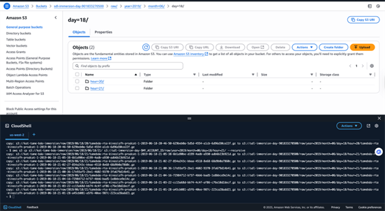
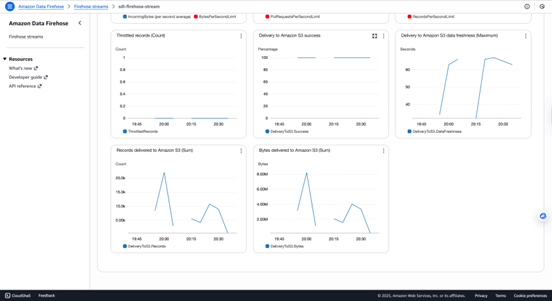
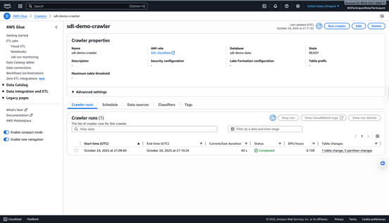
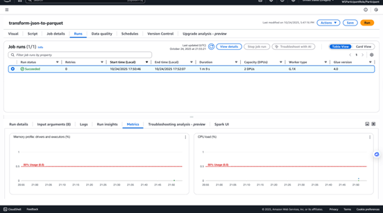
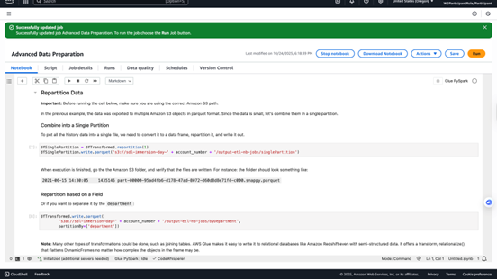
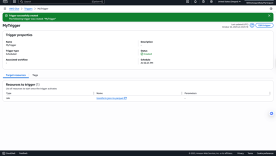
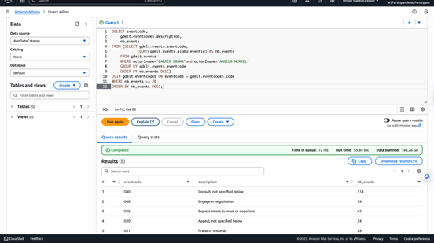
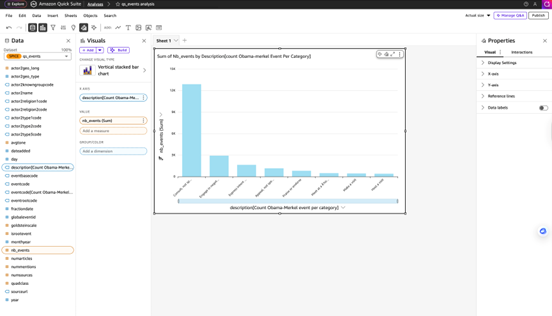

# AWS Serverless Data Lake Immersion
### 1. Batch Ingestion into S3
```
export MY_ACCOUNT_ID="$(aws sts get-caller-identity --query Account --output text)"

aws s3 cp s3://kat-tame-bda-immersion/raw/2019/06/18/20/ s3://sdl-immersion-day-$MY_ACCOUNT_ID/raw/year=2019/month=06/day=18/hour=20/ --recursive
aws s3 cp s3://kat-tame-bda-immersion/raw/2019/06/18/21/ s3://sdl-immersion-day-$MY_ACCOUNT_ID/raw/year=2019/month=06/day=18/hour=21/ --recursive
```


### 2. Real-Time Data Streaming into S3
```
{
    "productName" : "{{commerce.productName}}",
    "color" : "{{commerce.color}}",
    "department" : "{{commerce.department}}",
    "product" : "{{commerce.product}}",
    "imageUrl": "{{image.imageUrl}}",
    "dateSoldSince": "{{date.past}}",
    "dateSoldUntil": "{{date.future}}",
    "price": {{random.number(
        {   "min":10,
            "max":150
        }
    )}},
    "campaign": "{{random.arrayElement(
        ["BlackFriday","10Percent","NONE"]
    )}}"
}
```


### 3. Create a Crawler to Auto-Discover Schema


### 4. Create a Transformation Job in Glue Studio
```
import sys
from awsglue.transforms import *
from awsglue.utils import getResolvedOptions
from pyspark.context import SparkContext
from awsglue.context import GlueContext
from awsglue.job import Job

# Fetching the job parameters
args = getResolvedOptions(sys.argv, ["JOB_NAME"])
# Initialization of the Spark session
sc = SparkContext()
glueContext = GlueContext(sc)
spark = glueContext.spark_session
job = Job(glueContext)
# Initialization for the Glue job bookmark feature - see https://docs.aws.amazon.com/glue/latest/dg/monitor-continuations.html
job.init(args["JOB_NAME"], args)

# Loading data from the Glue catalog
# Script generated for node Amazon S3
AmazonS3_node1705070056445 = glueContext.create_dynamic_frame.from_catalog(
    database="sdl-demo-data",
    table_name="raw",
    transformation_ctx="AmazonS3_node1705070056445",
)

# Modifying the schema before writing out the results
# Script generated for node Change Schema
ChangeSchema_node1705071751723 = ApplyMapping.apply(
    frame=AmazonS3_node1705070056445,
    mappings=[
        ("productname", "string", "productname", "string"),
        ("department", "string", "department", "string"),
        ("product", "string", "product", "string"),
        ("imageurl", "string", "imageurl", "string"),
        ("datesoldsince", "string", "date_start", "string"),
        ("datesolduntil", "string", "date_until", "string"),
        ("price", "int", "price", "int"),
        ("campaign", "string", "campaign", "string"),
        ("year", "string", "year", "string"),
        ("month", "string", "month", "string"),
        ("day", "string", "day", "string"),
        ("hour", "string", "hour", "string"),
    ],
    transformation_ctx="ChangeSchema_node1705071751723",
)

# Writing the results in the Parquet format with Snappy compression to the target S3 path
# Script generated for node Amazon S3
AmazonS3_node1705070157358 = glueContext.write_dynamic_frame.from_options(
    frame=ChangeSchema_node1705071751723,
    connection_type="s3",
    format="glueparquet",
    connection_options={
        "path": "s3://sdl-immersion-day-<ACCOUNT_ID>/compressed-parquet/",
        "partitionKeys": [],
    },
    format_options={"compression": "snappy"},
    transformation_ctx="AmazonS3_node1705070157358",
)

# Commit for the Glue job bookmark feature - see https://docs.aws.amazon.com/glue/latest/dg/monitor-continuations.html
job.commit()
```


### 5. Develop and Test ETL Scripts in Jupyter Notebook


### 6. Add a Trigger Function in AWS Glue


### 7. Create Glue Database using Athena
- Create the eventcodes table:
```
        CREATE EXTERNAL TABLE IF NOT EXISTS gdelt.eventcodes (
            `code` string,
            `description` string
        )
        ROW FORMAT SERDE 'org.apache.hadoop.hive.serde2.lazy.LazySimpleSerDe'
        WITH SERDEPROPERTIES (
            'serialization.format' = '\t','field.delim' = '\t')
        LOCATION 's3://<YOUR_BUCKET_NAME>/gdelt/eventcodes/'
        TBLPROPERTIES ( "skip.header.line.count"="1")
```
- Create the types table:
```
  CREATE EXTERNAL TABLE IF NOT EXISTS gdelt.types (
    `type` string,
    `description` string
    )
    ROW FORMAT SERDE 'org.apache.hadoop.hive.serde2.lazy.LazySimpleSerDe'
    WITH SERDEPROPERTIES (
        'serialization.format' = '\t','field.delim' = '\t')
    LOCATION 's3://<YOUR_BUCKET_NAME>/gdelt/types/'
    TBLPROPERTIES ( "skip.header.line.count"="1");
```
- Create the groups table:
```
    CREATE EXTERNAL TABLE IF NOT EXISTS gdelt.groups (
        `group` string,
        `description` string
    )
    ROW FORMAT SERDE 'org.apache.hadoop.hive.serde2.lazy.LazySimpleSerDe'
    WITH SERDEPROPERTIES (
            'serialization.format' = '\t','field.delim' = '\t')
    LOCATION 's3://<YOUR_BUCKET_NAME>/gdelt/groups/'
    TBLPROPERTIES ( "skip.header.line.count"="1");
```
- Create the countries table:
```
    CREATE EXTERNAL TABLE IF NOT EXISTS gdelt.countries (
        `code` string,
        `country` string
    )
    ROW FORMAT SERDE 'org.apache.hadoop.hive.serde2.lazy.LazySimpleSerDe'
    WITH SERDEPROPERTIES (
            'serialization.format' = '\t','field.delim' = '\t')
    LOCATION 's3://<YOUR_BUCKET_NAME>/gdelt/countries/'
    TBLPROPERTIES ( "skip.header.line.count"="1");
```
- Find the number of events per year
```
SELECT year,
    COUNT(globaleventid) AS nb_events
FROM gdelt.events
GROUP BY year
ORDER BY year ASC;
```


### 8. Visualize Data in QuickSight

